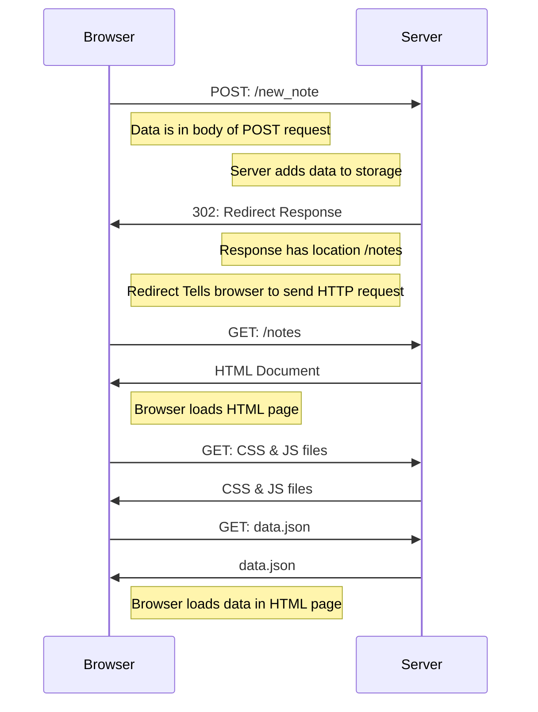

```mermaid
sequenceDiagram

Browser->>Server:POST: /new_note
Note right of Browser: Data is in body of POST request
Note left of Server: Server adds data to storage
Server->>Browser:302: Redirect Response
Note left of Server: Response has location /notes
Note right of Browser: Redirect Tells browser to send HTTP request
Browser->>Server:GET: /notes
Server->>Browser: HTML Document
Note right of Browser: Browser loads HTML page
Browser->>Server:GET: CSS & JS files
Server->>Browser: CSS & JS files
Browser->>Server:GET: data.json
Server->>Browser:data.json
Note right of Browser: Browser loads data in HTML page
```
